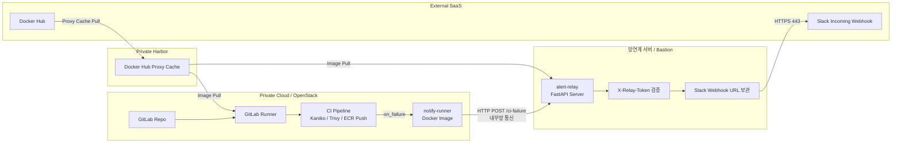

# Bastion Alert Relay 기반 Slack 알림 구성

## 1. 목적

폐쇄망 기반 GitLab CI/CD 환경에서 GitLab Runner가 외부 Slack Webhook을 직접 호출하지 않도록 분리한다.

GitLab Runner는 내부망의 Bastion Alert Relay로 실패 이벤트만 전달하고, Slack Webhook 호출은 망연계 서버 또는 Bastion 서버에서만 수행한다.

이를 통해 Private 영역의 직접 인터넷 egress를 차단하면서도 CI/CD 실패 알림 체계를 유지한다.

---

## 2. 전체 구조

```text
GitLab Runner
  └─ notify-runner 이미지 실행
      └─ Bastion Alert Relay로 실패 이벤트 POST

Bastion / 망연계 서버
  └─ alert-relay 이미지 실행
      └─ Slack Webhook 호출

Slack
  └─ CI/CD 실패 알림 수신
```

---

## 3. 아키텍처 다이어그램



---

## 4. 이미지 구성

현재 사용하는 이미지는 2개다.

| 이미지             | 실행 위치             | 역할                                  |
| --------------- | ----------------- | ----------------------------------- |
| `notify-runner` | GitLab Runner Job | CI 실패 정보를 Bastion Alert Relay로 POST |
| `alert-relay`   | Bastion / 망연계 서버  | 실패 이벤트 수신 후 Slack Webhook 호출        |

---

## 5. 이미지 저장 및 Pull 전략

폐쇄망 VM 또는 Runner에서는 이미지를 빌드하지 않는다.

이미지는 인터넷 가능한 로컬/WSL에서 빌드 후 Docker Hub에 Push한다.
폐쇄망에서는 Harbor Docker Hub Proxy Cache를 통해 완성 이미지만 Pull해서 사용한다.

```text
[인터넷 가능 환경]
docker build
docker push Docker Hub

        ↓

[Harbor Docker Hub Proxy Cache]
Docker Hub 이미지 캐싱

        ↓

[폐쇄망 GitLab Runner / Bastion]
Harbor 경로로 이미지 Pull 및 실행
```

예시 이미지 경로:

```text
Docker Hub:
jeongseungmin/notify-runner:1.0.0
jeongseungmin/alert-relay:1.0.0

Harbor Proxy Cache:
harbor.intp.me/docker-hub/jeongseungmin/notify-runner:1.0.0
harbor.intp.me/docker-hub/jeongseungmin/alert-relay:1.0.0
```

---

## 6. Dockerfile의 FROM 이미지 처리 방식

현재 VM 또는 폐쇄망 환경에서는 빌드를 수행하지 않고, 완성된 이미지만 Pull해서 실행한다.

따라서 Dockerfile 내부의 다음 base image들은 로컬/WSL 빌드 시점에만 사용된다.

```dockerfile
FROM alpine:3.20
```

```dockerfile
FROM python:3.12-slim
```

완성 이미지를 Docker Hub에 Push하면 base image 레이어와 설치된 패키지가 최종 이미지에 포함된다.

따라서 폐쇄망에서 다음 이미지만 Pull하면 된다.

```bash
docker pull harbor.intp.me/docker-hub/jeongseungmin/notify-runner:1.0.0
docker pull harbor.intp.me/docker-hub/jeongseungmin/alert-relay:1.0.0
```

폐쇄망에서는 `apk add`, `apt-get install`, `pip install`, `docker build`를 수행하지 않는다.

---

## 7. notify-runner 이미지

### 7.1 역할

`notify-runner`는 GitLab CI 실패 시 실행되는 알림 전송용 이미지다.

역할은 다음과 같다.

```text
1. GitLab CI 환경 변수 수집
2. 실패 Job, Stage, Pipeline URL, Job URL 정리
3. ci_error_summary.txt가 있으면 마지막 80줄 추출
4. Bastion Alert Relay의 /ci-failure 엔드포인트로 POST
```

Slack Webhook URL은 이 이미지에 포함하지 않는다.

---

### 7.2 Dockerfile

경로:

```text
infra-images/notify-runner/Dockerfile
```

```dockerfile
FROM alpine:3.20

RUN apk add --no-cache \
    curl \
    jq \
    ca-certificates \
    tzdata \
    && update-ca-certificates

COPY notify.sh /usr/local/bin/notify.sh
RUN chmod +x /usr/local/bin/notify.sh

ENTRYPOINT ["/usr/local/bin/notify.sh"]
```

---

### 7.3 notify.sh

경로:

```text
infra-images/notify-runner/notify.sh
```

```sh
#!/usr/bin/env sh
set -eu

echo "[notify-runner] start failure notification"

if [ -z "${ALERT_RELAY_URL:-}" ]; then
  echo "[notify-runner] ALERT_RELAY_URL is not set. Skip alert."
  exit 0
fi

if [ -z "${ALERT_RELAY_TOKEN:-}" ]; then
  echo "[notify-runner] ALERT_RELAY_TOKEN is not set. Skip alert."
  exit 0
fi

ERROR_SUMMARY_FILE="${ERROR_SUMMARY_FILE:-ci_error_summary.txt}"

if [ -f "$ERROR_SUMMARY_FILE" ]; then
  ERROR_SUMMARY="$(tail -n 80 "$ERROR_SUMMARY_FILE")"
else
  ERROR_SUMMARY="No error summary file found. Check GitLab pipeline log."
fi

jq -n \
  --arg project "${CI_PROJECT_NAME:-unknown}" \
  --arg project_path "${CI_PROJECT_PATH:-unknown}" \
  --arg job "${CI_JOB_NAME:-unknown}" \
  --arg stage "${CI_JOB_STAGE:-unknown}" \
  --arg status "failed" \
  --arg branch "${CI_COMMIT_REF_NAME:-unknown}" \
  --arg commit "${CI_COMMIT_SHORT_SHA:-unknown}" \
  --arg pipeline_url "${CI_PIPELINE_URL:-unknown}" \
  --arg job_url "${CI_JOB_URL:-unknown}" \
  --arg error_summary "$ERROR_SUMMARY" \
  '{
    project: $project,
    project_path: $project_path,
    job: $job,
    stage: $stage,
    status: $status,
    branch: $branch,
    commit: $commit,
    pipeline_url: $pipeline_url,
    job_url: $job_url,
    error_summary: $error_summary
  }' > /tmp/alert-payload.json

echo "[notify-runner] send alert to relay: ${ALERT_RELAY_URL}"

curl -sS -X POST "$ALERT_RELAY_URL" \
  -H "Content-Type: application/json" \
  -H "X-Relay-Token: ${ALERT_RELAY_TOKEN}" \
  --data-binary @/tmp/alert-payload.json

echo
echo "[notify-runner] alert sent"
```

---

## 8. alert-relay 이미지

### 8.1 역할

`alert-relay`는 Bastion 또는 망연계 서버에서 실행되는 FastAPI 기반 Relay 서버다.

역할은 다음과 같다.

```text
1. GitLab Runner의 /ci-failure 요청 수신
2. X-Relay-Token 검증
3. Slack 메시지 포맷 변환
4. Slack Incoming Webhook으로 알림 전송
```

Slack Webhook URL은 Bastion 서버의 컨테이너 환경 변수로만 주입한다.

---

### 8.2 requirements.txt

경로:

```text
infra-images/alert-relay/requirements.txt
```

```txt
fastapi==0.115.6
uvicorn==0.34.0
requests==2.32.3
```

---

### 8.3 Dockerfile

경로:

```text
infra-images/alert-relay/Dockerfile
```

```dockerfile
FROM python:3.12-slim

ENV PYTHONDONTWRITEBYTECODE=1
ENV PYTHONUNBUFFERED=1

WORKDIR /app

RUN apt-get update \
    && apt-get install -y --no-install-recommends \
      ca-certificates \
      curl \
    && rm -rf /var/lib/apt/lists/* \
    && update-ca-certificates

COPY requirements.txt .
RUN pip install --no-cache-dir -r requirements.txt

COPY app.py .

EXPOSE 8080

CMD ["uvicorn", "app:app", "--host", "0.0.0.0", "--port", "8080"]
```

---

### 8.4 app.py

경로:

```text
infra-images/alert-relay/app.py
```

````python
import os
from datetime import datetime, timezone

import requests
from fastapi import FastAPI, Header, HTTPException, Request

app = FastAPI(title="Bastion Alert Relay")

SLACK_WEBHOOK_URL = os.getenv("SLACK_WEBHOOK_URL")
RELAY_TOKEN = os.getenv("RELAY_TOKEN")


@app.get("/health")
def health():
    return {
        "status": "ok",
        "service": "alert-relay",
    }


@app.post("/ci-failure")
async def ci_failure(
    request: Request,
    x_relay_token: str | None = Header(default=None),
):
    if not SLACK_WEBHOOK_URL:
        raise HTTPException(
            status_code=500,
            detail="SLACK_WEBHOOK_URL is not set",
        )

    if not RELAY_TOKEN:
        raise HTTPException(
            status_code=500,
            detail="RELAY_TOKEN is not set",
        )

    if x_relay_token != RELAY_TOKEN:
        raise HTTPException(
            status_code=401,
            detail="invalid relay token",
        )

    payload = await request.json()

    project = payload.get("project", "unknown")
    project_path = payload.get("project_path", "unknown")
    job = payload.get("job", "unknown")
    stage = payload.get("stage", "unknown")
    status = payload.get("status", "failed")
    branch = payload.get("branch", "unknown")
    commit = payload.get("commit", "unknown")
    pipeline_url = payload.get("pipeline_url", "")
    job_url = payload.get("job_url", "")
    error_summary = payload.get("error_summary", "No error summary provided")

    occurred_at = datetime.now(timezone.utc).isoformat()

    slack_message = {
        "text": f"CI/CD Failure Alert - {project}",
        "blocks": [
            {
                "type": "header",
                "text": {
                    "type": "plain_text",
                    "text": "🚨 CI/CD Failure Alert",
                },
            },
            {
                "type": "section",
                "fields": [
                    {"type": "mrkdwn", "text": f"*Project:*\n{project}"},
                    {"type": "mrkdwn", "text": f"*Status:*\n{status}"},
                    {"type": "mrkdwn", "text": f"*Stage:*\n{stage}"},
                    {"type": "mrkdwn", "text": f"*Job:*\n{job}"},
                    {"type": "mrkdwn", "text": f"*Branch:*\n{branch}"},
                    {"type": "mrkdwn", "text": f"*Commit:*\n{commit}"},
                ],
            },
            {
                "type": "section",
                "text": {
                    "type": "mrkdwn",
                    "text": (
                        f"*Project Path:*\n`{project_path}`\n\n"
                        f"*Pipeline:*\n{pipeline_url}\n\n"
                        f"*Job Log:*\n{job_url}"
                    ),
                },
            },
            {
                "type": "section",
                "text": {
                    "type": "mrkdwn",
                    "text": f"*Error Summary:*\n```{error_summary[:2500]}```",
                },
            },
            {
                "type": "context",
                "elements": [
                    {
                        "type": "mrkdwn",
                        "text": f"Generated by Bastion Alert Relay at {occurred_at}",
                    }
                ],
            },
        ],
    }

    try:
        response = requests.post(
            SLACK_WEBHOOK_URL,
            json=slack_message,
            timeout=5,
        )
        response.raise_for_status()
    except requests.RequestException as exc:
        raise HTTPException(
            status_code=502,
            detail=f"failed to send slack alert: {exc}",
        )

    return {
        "status": "sent",
        "project": project,
        "job": job,
    }
````

---

## 9. 이미지 빌드 및 Docker Hub Push

이미 빌드 후 Docker Hub에 Push한 경우 이 단계는 참고용이다.

### 9.1 notify-runner

```bash
cd infra-images/notify-runner

docker build -t jeongseungmin/notify-runner:1.0.0 .

docker login

docker push jeongseungmin/notify-runner:1.0.0
```

---

### 9.2 alert-relay

```bash
cd infra-images/alert-relay

docker build -t jeongseungmin/alert-relay:1.0.0 .

docker login

docker push jeongseungmin/alert-relay:1.0.0
```

---

## 10. Harbor Proxy Cache Pull 테스트

폐쇄망 또는 Harbor 접근 가능한 노드에서 다음을 실행한다.

```bash
docker pull harbor.intp.me/docker-hub/jeongseungmin/notify-runner:1.0.0
docker pull harbor.intp.me/docker-hub/jeongseungmin/alert-relay:1.0.0
```

containerd 기반 Kubernetes 노드에서는 다음처럼 확인할 수 있다.

```bash
sudo ctr -n k8s.io images pull \
  harbor.intp.me/docker-hub/jeongseungmin/notify-runner:1.0.0
```

```bash
sudo ctr -n k8s.io images pull \
  harbor.intp.me/docker-hub/jeongseungmin/alert-relay:1.0.0
```

---

## 11. Bastion에서 alert-relay 실행

### 11.1 RELAY_TOKEN 생성

```bash
openssl rand -hex 32
```

예시:

```text
b8d5f83e71f24c0e9e7b4e0dcb50e1b55c5cc6a5db1b3f8f79fbbd5d39c9c111
```

---

### 11.2 docker run 방식

```bash
docker run -d \
  --name alert-relay \
  --restart unless-stopped \
  -p 8080:8080 \
  -e SLACK_WEBHOOK_URL="https://hooks.slack.com/services/XXX/YYY/ZZZ" \
  -e RELAY_TOKEN="<relay-token>" \
  harbor.intp.me/docker-hub/jeongseungmin/alert-relay:1.0.0
```

---

### 11.3 상태 확인

```bash
docker ps
docker logs -f alert-relay
curl http://127.0.0.1:8080/health
```

정상 응답:

```json
{"status":"ok","service":"alert-relay"}
```

---

## 12. GitLab CI에서 notify-runner 사용

GitLab CI/CD Variables에 다음 값을 등록한다.

| 변수명                 | 값                                             | 설명                     |
| ------------------- | --------------------------------------------- | ---------------------- |
| `ALERT_RELAY_URL`   | `http://<BASTION_PRIVATE_IP>:8080/ci-failure` | Bastion Alert Relay 주소 |
| `ALERT_RELAY_TOKEN` | `<relay-token>`                               | Bastion과 공유하는 인증 토큰    |

Slack Webhook URL은 GitLab CI/CD Variable에 등록하지 않는다.

---

### 12.1 .gitlab-ci.yml 예시

```yaml
stages:
  - build
  - scan
  - push
  - deploy
  - notify

notify_failure:
  stage: notify
  image:
    name: harbor.intp.me/docker-hub/jeongseungmin/notify-runner:1.0.0
    entrypoint: [""]
  script:
    - /usr/local/bin/notify.sh
  when: on_failure
  allow_failure: true
  tags:
    - gpu-worker
```

---

### 12.2 실패 로그 파일 연동 예시

각 Job에서 `ci_error_summary.txt`를 남기면 `notify-runner`가 자동으로 마지막 80줄을 읽어 Slack 알림에 포함한다.

예시:

```yaml
sync_harbor_to_ecr:
  stage: push
  image: harbor.intp.me/infra/ecr-sync-tools:1.0.0
  script:
    - |
      {
        echo "[sync] start harbor to ecr sync"
        skopeo copy \
          docker://$HARBOR_IMAGE \
          docker://$ECR_IMAGE
      } 2>&1 | tee ci_error_summary.txt
  artifacts:
    when: always
    paths:
      - ci_error_summary.txt
    expire_in: 1 day
  tags:
    - gpu-worker
```

notify Job에서 artifact를 받아야 하는 경우:

```yaml
notify_failure:
  stage: notify
  image:
    name: harbor.intp.me/docker-hub/jeongseungmin/notify-runner:1.0.0
    entrypoint: [""]
  needs:
    - job: sync_harbor_to_ecr
      artifacts: true
      optional: true
  script:
    - /usr/local/bin/notify.sh
  when: on_failure
  allow_failure: true
  tags:
    - gpu-worker
```

---

## 13. 필요한 포트 및 통신 규격

### 13.1 통신 경로 요약

| 출발지                 | 목적지                 |          프로토콜 |          포트 | 방향       | 용도                      |
| ------------------- | ------------------- | ------------: | ----------: | -------- | ----------------------- |
| GitLab Runner       | Harbor              |         HTTPS |         443 | 내부       | notify-runner 이미지 Pull  |
| Bastion             | Harbor              |         HTTPS |         443 | 내부       | alert-relay 이미지 Pull    |
| GitLab Runner       | Bastion Alert Relay | HTTP 또는 HTTPS | 8080 또는 443 | 내부       | 실패 이벤트 POST             |
| Bastion Alert Relay | Slack Webhook       |         HTTPS |         443 | 외부       | Slack 알림 전송             |
| 관리자 PC              | Bastion             |           SSH |          22 | 관리망      | Bastion 관리              |
| Bastion             | DNS                 |       UDP/TCP |          53 | 내부 또는 외부 | `hooks.slack.com` 이름 해석 |

---

### 13.2 최소 허용 정책

Private 전체에서 인터넷 직접 접근은 차단한다.

허용해야 하는 최소 경로는 다음과 같다.

```text
GitLab Runner → Harbor:443
Bastion → Harbor:443
GitLab Runner → Bastion:8080
Bastion → hooks.slack.com:443
관리자 PC → Bastion:22
```

---

### 13.3 권장 방화벽 정책

```text
Inbound on Bastion:
- GitLab Runner IP → TCP 8080 허용
- 관리자 IP → TCP 22 허용
- 그 외 차단

Outbound on Bastion:
- Harbor 내부 주소 → TCP 443 허용
- hooks.slack.com → TCP 443 허용
- DNS 서버 → UDP/TCP 53 허용
- 그 외 차단
```

---

## 14. HTTP API 규격

### 14.1 Health Check

```http
GET /health
```

응답 예시:

```json
{
  "status": "ok",
  "service": "alert-relay"
}
```

---

### 14.2 CI Failure Alert

```http
POST /ci-failure
Content-Type: application/json
X-Relay-Token: <relay-token>
```

요청 Body:

```json
{
  "project": "hybrid-ai-serving-platform",
  "project_path": "SGS-Strategy/hybrid-ai-serving-platform",
  "job": "sync_harbor_to_ecr",
  "stage": "push",
  "status": "failed",
  "branch": "main",
  "commit": "abc1234",
  "pipeline_url": "http://gitlab.local/pipeline/1",
  "job_url": "http://gitlab.local/job/1",
  "error_summary": "error log summary"
}
```

정상 응답:

```json
{
  "status": "sent",
  "project": "hybrid-ai-serving-platform",
  "job": "sync_harbor_to_ecr"
}
```

인증 실패 응답:

```json
{
  "detail": "invalid relay token"
}
```

---

## 15. 테스트 방법

### 15.1 Bastion 내부 테스트

```bash
curl -X POST http://127.0.0.1:8080/ci-failure \
  -H "Content-Type: application/json" \
  -H "X-Relay-Token: <relay-token>" \
  -d '{
    "project":"hybrid-ai-serving-platform",
    "project_path":"SGS-Strategy/hybrid-ai-serving-platform",
    "job":"manual-test",
    "stage":"test",
    "status":"failed",
    "branch":"main",
    "commit":"abc1234",
    "pipeline_url":"http://gitlab.local/pipeline/test",
    "job_url":"http://gitlab.local/job/test",
    "error_summary":"Bastion alert-relay test message"
  }'
```

Slack에 메시지가 오면 Bastion → Slack 통신이 성공한 것이다.

---

### 15.2 GitLab Runner에서 Bastion 접근 테스트

```bash
curl http://<BASTION_PRIVATE_IP>:8080/health
```

정상 응답:

```json
{"status":"ok","service":"alert-relay"}
```

---

### 15.3 GitLab Pipeline 실패 테스트

```yaml
fail_test:
  stage: build
  image:
    name: harbor.intp.me/docker-hub/jeongseungmin/notify-runner:1.0.0
    entrypoint: [""]
  script:
    - echo "intentional failure"
    - exit 1
  tags:
    - gpu-worker
```

Pipeline 실패 후 `notify_failure` Job이 실행되고 Slack 알림이 오면 전체 흐름이 정상이다.

---

## 16. 운영 점검 명령어

### 16.1 Bastion 컨테이너 확인

```bash
docker ps
docker logs -f alert-relay
```

---

### 16.2 Bastion 포트 확인

```bash
sudo ss -lntp | grep 8080
```

---

### 16.3 Slack 통신 확인

```bash
curl -I https://hooks.slack.com
```

---

### 16.4 Harbor 이미지 Pull 확인

```bash
docker pull harbor.intp.me/docker-hub/jeongseungmin/notify-runner:1.0.0
docker pull harbor.intp.me/docker-hub/jeongseungmin/alert-relay:1.0.0
```

---

## 17. 보안 원칙

1. GitLab Runner는 Slack Webhook URL을 알지 않는다.
2. Slack Webhook URL은 Bastion의 `alert-relay` 컨테이너 환경 변수로만 주입한다.
3. GitLab Runner는 Bastion 내부 주소로만 통신한다.
4. Bastion만 외부 Slack Webhook으로 HTTPS 요청을 보낸다.
5. `X-Relay-Token`으로 내부 요청을 검증한다.
6. Bastion 방화벽에서 GitLab Runner IP만 8080 접근을 허용한다.
7. Bastion outbound는 `hooks.slack.com:443`만 허용하는 것을 권장한다.
8. VM 또는 폐쇄망 환경에서는 이미지 빌드를 수행하지 않고 완성 이미지만 사용한다.

---

## 18. 장애 대응 체크리스트

### Slack 알림이 오지 않을 때

1. `alert-relay` 컨테이너가 실행 중인지 확인한다.

```bash
docker ps
docker logs -f alert-relay
```

2. Bastion에서 Slack Webhook 접근이 가능한지 확인한다.

```bash
curl -I https://hooks.slack.com
```

3. Bastion에서 `/health`가 정상인지 확인한다.

```bash
curl http://127.0.0.1:8080/health
```

4. GitLab Runner에서 Bastion으로 접근 가능한지 확인한다.

```bash
curl http://<BASTION_PRIVATE_IP>:8080/health
```

5. GitLab CI Variable이 올바른지 확인한다.

```text
ALERT_RELAY_URL
ALERT_RELAY_TOKEN
```

6. Bastion의 `RELAY_TOKEN`과 GitLab의 `ALERT_RELAY_TOKEN`이 같은지 확인한다.

---

## 19. 포트폴리오 설명 문구

폐쇄망 CI/CD 환경에서 GitLab Runner가 외부 Slack Webhook을 직접 호출하지 않도록 Bastion Alert Relay 구조를 설계하였다. GitLab Runner는 내부망의 Relay API로 실패 이벤트만 전송하고, Slack Webhook URL은 망연계 서버에만 보관하였다. Bastion은 토큰 검증 후 제한된 outbound 443 정책으로 Slack 알림을 발송한다. 이를 통해 Private 영역의 직접 인터넷 egress를 차단하면서도 CI/CD 장애 알림 체계를 유지하였다.

---

## 20. 최종 요약

```text
빌드:
- 인터넷 가능한 로컬/WSL에서 수행
- Docker Hub에 notify-runner, alert-relay Push

사용:
- 폐쇄망에서는 Harbor Docker Hub Proxy Cache 경유 Pull
- GitLab Runner는 notify-runner 실행
- Bastion은 alert-relay 실행

보안:
- Slack Webhook URL은 Bastion에만 존재
- Runner는 Bastion 내부 API만 호출
- Bastion만 Slack Webhook 443 outbound 허용
```
