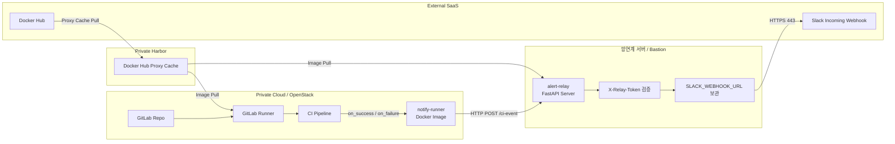

# Bastion Alert Relay 기반 GitLab CI Slack 알림 구성

## 1. 목적

폐쇄망 GitLab Runner가 Slack Webhook을 직접 호출하지 않도록 알림 경로를 분리한다.

- GitLab Runner는 내부 `alert-relay` API로만 CI 이벤트를 POST한다.
- `alert-relay` 컨테이너만 `SLACK_WEBHOOK_URL`을 가진다.
- 성공과 실패 알림 모두 Slack으로 전달한다.
- 권장 엔드포인트는 `/ci-event`이며, `/ci-failure`는 하위호환용으로 유지한다.

---

## 2. 전체 구조

```text
GitLab Runner
  └─ notify-runner 이미지 실행
      └─ Bastion Alert Relay(/ci-event)로 CI 이벤트 POST

Bastion / 망연계 서버
  └─ alert-relay 이미지 실행
      └─ X-Relay-Token 검증
      └─ Slack Incoming Webhook 호출

Slack
  └─ 성공/실패 알림 수신
```

---

## 3. 아키텍처 다이어그램



---

## 4. 이미지 구성

| 이미지 | 실행 위치 | 역할 |
| --- | --- | --- |
| `notify-runner` | GitLab Runner Job | 성공/실패 CI 이벤트를 Bastion Alert Relay로 POST |
| `alert-relay` | Bastion / 망연계 서버 | CI 이벤트 수신 후 Slack Webhook 호출 |

---

## 5. 저장 및 Pull 전략

폐쇄망에서는 이미지를 빌드하지 않고 완성 이미지만 Pull한다.

```text
[인터넷 가능 환경]
docker build
docker push Docker Hub

        ↓

[Harbor Docker Hub Proxy Cache]
Docker Hub 이미지 캐싱

        ↓

[폐쇄망 GitLab Runner / Bastion]
Harbor 경로로 이미지 Pull 및 실행
```

예시 경로:

```text
Docker Hub:
jeongseungmin/notify-runner:latest
jeongseungmin/alert-relay:latest

Harbor Proxy Cache:
harbor.intp.me/docker-hub/jeongseungmin/notify-runner:latest
harbor.intp.me/docker-hub/jeongseungmin/alert-relay:latest
```

---

## 6. notify-runner

### 6.1 역할

`notify-runner`는 성공/실패 공통 알림 전송용 이미지다.

```text
1. GitLab CI 환경 변수 수집
2. NOTIFY_STATUS 결정
3. NOTIFY_SUMMARY 또는 ci_error_summary.txt 기반 summary 생성
4. alert-relay 엔드포인트로 JSON payload POST
```

Slack Webhook URL은 포함하지 않는다.

### 6.2 지원 환경변수

| 변수명 | 설명 |
| --- | --- |
| `ALERT_RELAY_URL` | Relay API 주소. 권장값: `http://<relay-host>:8080/ci-event` |
| `ALERT_RELAY_TOKEN` | Bastion과 공유하는 인증 토큰 |
| `NOTIFY_STATUS` | `success`, `failed`, `warning` 등. 기본값은 `failed` |
| `NOTIFY_SUMMARY` | summary 직접 지정 시 우선 사용 |
| `ERROR_SUMMARY_FILE` | 기본값 `ci_error_summary.txt` |

### 6.3 동작 규칙

- `ALERT_RELAY_URL` 또는 `ALERT_RELAY_TOKEN`이 없으면 실패시키지 않고 `exit 0` 한다.
- `NOTIFY_SUMMARY`가 있으면 파일보다 우선한다.
- summary 파일이 있으면 마지막 80줄만 읽는다.
- payload에는 `summary`와 `error_summary`를 모두 넣어 하위호환을 유지한다.
- `/ci-event`와 `/ci-failure` 둘 다 호출 가능하다.

---

## 7. alert-relay

### 7.1 역할

`alert-relay`는 Bastion 또는 망연계 서버에서 동작하는 FastAPI 서버다.

```text
1. /ci-event 요청 수신
2. X-Relay-Token 검증
3. status 값에 따라 Slack 메시지 포맷 생성
4. Slack Incoming Webhook으로 알림 전송
```

### 7.2 엔드포인트

| 엔드포인트 | 설명 |
| --- | --- |
| `GET /health` | 헬스체크 |
| `POST /ci-event` | 권장 공통 엔드포인트 |
| `POST /ci-failure` | 하위호환용 실패 엔드포인트 |

`/ci-failure`는 내부적으로 공통 로직을 사용하며, `status`가 없으면 `failed`로 처리한다.

### 7.3 status별 Slack 제목

| status | Slack 제목 |
| --- | --- |
| `success` | `✅ CI/CD Success Alert` |
| `failed` | `🚨 CI/CD Failure Alert` |
| `warning` | `⚠️ CI/CD Warning Alert` |
| 그 외 | `ℹ️ CI/CD Pipeline Event` |

### 7.4 지원 payload 필드

```json
{
  "project": "hybrid-ai-serving-platform",
  "project_path": "SGS-Strategy/hybrid-ai-serving-platform",
  "job": "notify-success",
  "stage": "notify",
  "status": "success",
  "branch": "main",
  "commit": "abc1234",
  "pipeline_url": "http://gitlab.local/pipeline/1",
  "job_url": "http://gitlab.local/job/1",
  "summary": "사설망 베이스 이미지 빌드 및 Trivy 스캔 완료",
  "error_summary": "legacy summary field",
  "occurred_at": "2026-06-30T00:00:00Z"
}
```

- `summary`가 있으면 우선 사용한다.
- `summary`가 없으면 `error_summary`를 사용한다.
- 긴 summary는 Slack 제한을 고려해 2500자까지 잘라서 보낸다.

---

## 8. Bastion에서 alert-relay 실행

### 8.1 RELAY_TOKEN 생성

```bash
openssl rand -hex 32
```

### 8.2 컨테이너 실행

```bash
docker run -d \
  --name alert-relay \
  --restart unless-stopped \
  -p 8080:8080 \
  -e SLACK_WEBHOOK_URL="https://hooks.slack.com/services/XXX/YYY/ZZZ" \
  -e RELAY_TOKEN="<relay-token>" \
  harbor.intp.me/docker-hub/jeongseungmin/alert-relay:latest
```

### 8.3 상태 확인

```bash
docker ps
docker logs -f alert-relay
curl http://127.0.0.1:8080/health
```

정상 응답:

```json
{"status":"ok","service":"alert-relay"}
```

---

## 9. GitLab CI 구성

실제 템플릿 경로는 `private/templates/.gitlab-ci.yml` 이다.

### 9.1 필요한 GitLab Variables

```text
ALERT_RELAY_URL=http://192.168.0.40:8080/ci-event
ALERT_RELAY_TOKEN=<relay-token>
```

중요:

- GitLab Variables에는 `SLACK_WEBHOOK_URL`을 넣지 않는다.
- `SLACK_WEBHOOK_URL`은 Bastion의 `alert-relay` 컨테이너 환경변수로만 사용한다.

### 9.2 성공/실패 알림 job 동작

- `notify-success`
  - `when: on_success`
  - `allow_failure: true`
  - `NOTIFY_STATUS=success`
- `notify_failure`
  - `when: on_failure`
  - `allow_failure: true`
  - `NOTIFY_STATUS=failed`

둘 중 하나만 실행된다.

### 9.3 성공 알림 summary 규칙

- `push` pipeline:
  - `사설망 베이스 이미지 빌드 및 Trivy 스캔 완료`
- `trigger` 또는 `api` pipeline:
  - `${MODEL_IMAGE_NAME} Harbor to ECR push 완료. tag=${IMAGE_TAG}`

### 9.4 job 흐름

`push` pipeline 성공 시:

```text
build-heavy-base
  -> trivy-scan
  -> notify-success
```

`trigger` 또는 `api` pipeline 성공 시:

```text
scan-model-image
  -> sync-harbor-to-ecr
  -> notify-success
```

실패 시:

```text
실패한 stage 이후 notify_failure만 실행
```

---

## 10. 테스트 방법

### 10.1 Runner에서 relay 헬스체크

```bash
curl http://192.168.0.40:8080/health
```

### 10.2 Bastion 내부 수동 success 이벤트 테스트

```bash
curl -X POST http://127.0.0.1:8080/ci-event \
  -H "Content-Type: application/json" \
  -H "X-Relay-Token: <relay-token>" \
  -d '{
    "project":"hybrid-ai-serving-platform",
    "project_path":"SGS-Strategy/hybrid-ai-serving-platform",
    "job":"manual-success-test",
    "stage":"notify",
    "status":"success",
    "branch":"main",
    "commit":"abc1234",
    "pipeline_url":"http://gitlab.local/pipeline/success",
    "job_url":"http://gitlab.local/job/success",
    "summary":"manual success event test",
    "occurred_at":"2026-06-30T00:00:00Z"
  }'
```

### 10.3 Bastion 내부 수동 failed 이벤트 테스트

```bash
curl -X POST http://127.0.0.1:8080/ci-event \
  -H "Content-Type: application/json" \
  -H "X-Relay-Token: <relay-token>" \
  -d '{
    "project":"hybrid-ai-serving-platform",
    "project_path":"SGS-Strategy/hybrid-ai-serving-platform",
    "job":"manual-failed-test",
    "stage":"notify",
    "status":"failed",
    "branch":"main",
    "commit":"abc1234",
    "pipeline_url":"http://gitlab.local/pipeline/failed",
    "job_url":"http://gitlab.local/job/failed",
    "summary":"manual failed event test",
    "occurred_at":"2026-06-30T00:00:00Z"
  }'
```

### 10.4 하위호환 `/ci-failure` 테스트

```bash
curl -X POST http://127.0.0.1:8080/ci-failure \
  -H "Content-Type: application/json" \
  -H "X-Relay-Token: <relay-token>" \
  -d '{
    "project":"hybrid-ai-serving-platform",
    "project_path":"SGS-Strategy/hybrid-ai-serving-platform",
    "job":"legacy-failure-test",
    "stage":"notify",
    "branch":"main",
    "commit":"abc1234",
    "pipeline_url":"http://gitlab.local/pipeline/legacy",
    "job_url":"http://gitlab.local/job/legacy",
    "error_summary":"legacy ci-failure compatibility test"
  }'
```

### 10.5 GitLab pipeline 테스트

성공 경로:

1. `push` pipeline에서 `Dockerfile.build`, `model_build.py`, `.gitlab-ci.yml` 중 하나를 변경해 실행한다.
2. pipeline 성공 후 `notify-success`만 실행되는지 확인한다.
3. Slack에 success 알림이 도착하는지 확인한다.

실패 경로:

1. `build-heavy-base`, `trivy-scan`, `scan-model-image`, `sync-harbor-to-ecr` 중 하나를 의도적으로 실패시킨다.
2. pipeline 실패 후 `notify_failure`만 실행되는지 확인한다.
3. Slack에 failed 알림이 도착하는지 확인한다.

---

## 11. 재빌드 및 Push

### 11.1 notify-runner

```bash
cd infra-alert-images/notify-runner
docker build -t jeongseungmin/notify-runner:latest .
docker push jeongseungmin/notify-runner:latest
```

### 11.2 alert-relay

```bash
cd infra-alert-images/alert-relay
docker build -t jeongseungmin/alert-relay:latest .
docker push jeongseungmin/alert-relay:latest
```

### 11.3 Harbor Proxy Cache Pull 확인

```bash
docker pull harbor.intp.me/docker-hub/jeongseungmin/notify-runner:latest
docker pull harbor.intp.me/docker-hub/jeongseungmin/alert-relay:latest
```

---

## 12. 보안 원칙

1. GitLab Runner는 Slack Webhook URL을 알지 않는다.
2. GitLab Runner는 Bastion 내부 API만 호출한다.
3. Bastion의 `alert-relay` 컨테이너만 `SLACK_WEBHOOK_URL`을 가진다.
4. 요청 인증은 `X-Relay-Token`과 `RELAY_TOKEN` 비교로 수행한다.
5. 성공/실패 알림 모두 내부 relay를 통해서만 Slack으로 전달한다.
6. 폐쇄망에서는 이미지 빌드를 수행하지 않고 완성 이미지만 사용한다.

---

## 13. 운영 체크리스트

Slack 알림이 오지 않을 때:

1. `alert-relay` 컨테이너 상태 확인

```bash
docker ps
docker logs -f alert-relay
```

2. Bastion에서 Slack Webhook 접근 확인

```bash
curl -I https://hooks.slack.com
```

3. Bastion 헬스체크 확인

```bash
curl http://127.0.0.1:8080/health
```

4. Runner에서 Bastion 접근 확인

```bash
curl http://192.168.0.40:8080/health
```

5. GitLab Variables 확인

```text
ALERT_RELAY_URL
ALERT_RELAY_TOKEN
```

6. Bastion `RELAY_TOKEN`과 GitLab `ALERT_RELAY_TOKEN` 값 일치 여부 확인

---

## 14. 요약

```text
GitLab CI
- notify-runner만 사용해 성공/실패 이벤트를 relay로 전달
- Slack Webhook URL은 사용하지 않음

Bastion
- alert-relay가 /ci-event 수신
- 토큰 검증 후 Slack Webhook 호출

알림 흐름
- 성공 pipeline: notify-success만 실행
- 실패 pipeline: notify_failure만 실행
- 권장 엔드포인트: /ci-event
- 하위호환 엔드포인트: /ci-failure
```
