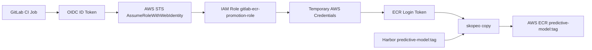

# GitLab OIDC for AWS ECR Promotion

GitLab CI에서 장기 AWS Access Key 없이 ECR push를 수행하기 위한 OIDC 구성입니다. 이 디렉터리는 Harbor에 있는 이미지를 AWS ECR로 promotion 하는 파이프라인이 `AssumeRoleWithWebIdentity` 방식으로 임시 자격 증명을 받도록 AWS IAM 리소스를 코드화합니다.

## 목적

- GitLab CI가 OIDC ID Token을 사용해 AWS STS에서 임시 자격 증명을 발급받도록 구성합니다.
- Harbor -> ECR promotion pipeline에 필요한 최소 IAM 권한만 부여합니다.
- ECR repository 생성 권한은 포함하지 않고, 기존 `predictive-model` repository만 대상으로 제한합니다.

## 전체 흐름

1. GitLab CI Job이 `id_tokens`로 OIDC ID Token을 발급받습니다.
2. Job이 `aws sts assume-role-with-web-identity`로 IAM Role `gitlab-ecr-promotion-role`을 가정합니다.
3. AWS STS가 임시 Access Key / Secret Key / Session Token을 반환합니다.
4. Job이 `aws ecr get-login-password`로 ECR login token을 발급받습니다.
5. `skopeo copy`가 Harbor 이미지를 ECR로 복사합니다.

## Flow



## 생성 리소스

- `aws_iam_openid_connect_provider`
  - issuer: `https://gitlab.intp.me`
  - audience: `sts.amazonaws.com`
- `aws_iam_role`
  - name: `gitlab-ecr-promotion-role`
  - trust policy:
    - `gitlab.intp.me:aud = sts.amazonaws.com`
    - `gitlab.intp.me:sub = project_path:3stacks/predictor-model:ref_type:branch:ref:main`
- `aws_iam_role_policy`
  - `ecr:GetAuthorizationToken` on `*`
  - selected ECR push/pull actions on `predictive-model` only

## 사용 방법

```bash
cd private/aws-oidc
terraform init
terraform plan
terraform apply
```

Terraform 인증은 `aws configure`, `AWS_PROFILE`, SSO, 환경변수 등 외부 방식에 맡깁니다. 코드 안에는 AWS Access Key나 Secret Key를 넣지 않습니다.

적용 후 GitLab CI/CD Variable에는 아래 값을 등록합니다.

```text
AWS_ROLE_ARN=<terraform output -raw aws_role_arn_gitlab_variable>
```

## 변수 기본값

- `aws_region = "ap-northeast-2"`
- `aws_account_id = "808379768010"`
- `gitlab_oidc_url = "https://gitlab.intp.me"`
- `gitlab_oidc_host = "gitlab.intp.me"`
- `gitlab_project_sub = "project_path:3stacks/predictor-model:ref_type:branch:ref:main"`
- `role_name = "gitlab-ecr-promotion-role"`
- `ecr_repository_name = "predictive-model"`

## 운영 메모

- 이 Terraform은 ECR repository를 생성하지 않습니다.
- GitLab issuer 인증서 thumbprint는 `tls_certificate` data source로 조회합니다.
- `gitlab.intp.me`에 Terraform 실행 환경에서 TLS로 접근 가능해야 OIDC provider plan/apply가 원활합니다.
