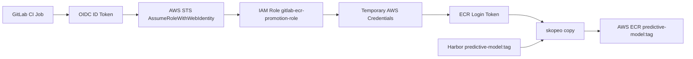

# GitLab OIDC for AWS ECR Promotion

GitLab CI에서 장기 AWS Access Key 없이 ECR push를 수행하기 위한 OIDC 구성입니다. 이 디렉터리는 Harbor에 있는 이미지를 AWS ECR로 promotion 하는 파이프라인이 `AssumeRoleWithWebIdentity` 방식으로 임시 자격 증명을 받도록 AWS IAM 리소스를 코드화합니다.

## 목적

- GitLab CI가 OIDC ID Token을 사용해 AWS STS에서 임시 자격 증명을 발급받도록 구성합니다.
- Harbor -> ECR promotion pipeline에 필요한 최소 IAM 권한만 부여합니다.
- ECR repository 생성 권한은 포함하지 않고, 기존 `predictive-model` repository만 대상으로 제한합니다.

## 전체 흐름

1. GitLab CI Job이 `id_tokens`로 OIDC ID Token을 발급받습니다.
2. Job이 `aws sts assume-role-with-web-identity`로 IAM Role `gitlab-ecr-promotion-role`을 가정합니다.
3. AWS STS가 임시 Access Key / Secret Key / Session Token을 반환합니다.
4. Job이 `aws ecr get-login-password`로 ECR login token을 발급받습니다.
5. `skopeo copy`가 Harbor 이미지를 ECR로 복사합니다.

## Flow



## 생성 리소스

- `aws_iam_openid_connect_provider`
  - issuer: `https://gitlab.intp.me`
  - audience: `sts.amazonaws.com`
- `aws_iam_role`
  - name: `gitlab-ecr-promotion-role`
  - trust policy:
    - `gitlab.intp.me:aud = sts.amazonaws.com`
    - `gitlab.intp.me:sub = project_path:3stacks/predictor-model:ref_type:branch:ref:main`
- `aws_iam_role_policy`
  - `ecr:GetAuthorizationToken` on `*`
  - selected ECR push/pull actions on `predictive-model` only

## 사용 방법

```bash
cd private/aws-oidc
cp backend.example.hcl backend.hcl
terraform init -backend-config=backend.hcl
```

Terraform 인증은 `aws configure`, `AWS_PROFILE`, SSO, 환경변수 등 외부 방식에 맡깁니다. 코드 안에는 AWS Access Key나 Secret Key를 넣지 않습니다.

이 모듈은 현재 `./ha apply` 또는 `Private Cloud Controller` 기본 DAG에 자동 연결되어 있지 않습니다. 기본 private cloud 프로비저닝은 `private/openstack` Terraform만 실행하고, `private/aws-oidc`는 별도 수동/선택 적용 모듈로 취급해야 안전합니다.

## Remote State

이 모듈은 GitHub Actions에서 실행할 경우 반드시 remote state를 사용해야 합니다. GitHub-hosted runner에서 local state로 실행하면 매 실행마다 state가 비어 있는 상태로 시작하므로, 이미 콘솔에 있는 OIDC Provider / IAM Role / inline policy를 다시 생성하려고 시도할 수 있습니다.

현재 레포의 AWS S3 backend 패턴은 아래와 같습니다.

- public Terraform bucket: `sgs-hasp-tfstate`
- public root key: `terraform/terraform.tfstate`
- in-cluster key: `terraform/incluster.tfstate`
- lock 방식: `use_lockfile = true`
- region: `ap-northeast-2`

이 모듈은 같은 bucket/region 패턴을 따르되 key를 분리해 사용합니다.

- 권장 key: `private/aws-oidc/terraform.tfstate`

예시 backend config:

```hcl
bucket       = "sgs-hasp-tfstate"
key          = "private/aws-oidc/terraform.tfstate"
region       = "ap-northeast-2"
use_lockfile = true
encrypt      = true
```

remote state 준비 후 권장 실행 순서:

```bash
cd private/aws-oidc
cp backend.example.hcl backend.hcl
terraform init -backend-config=backend.hcl
terraform plan
```

신규 환경이라면 remote state를 먼저 연결한 뒤 `terraform apply`로 생성할 수 있습니다. 기존 콘솔 리소스가 이미 있는 환경이라면 `terraform apply` 전에 import를 먼저 수행하고, `terraform plan`으로 drift를 확인한 뒤부터 `plan/apply`로 관리해야 합니다.

## Existing Console Resources

현재 환경에는 아래 AWS 리소스가 이미 콘솔에 존재합니다.

- OIDC Provider: `arn:aws:iam::808379768010:oidc-provider/gitlab.intp.me`
- IAM Role: `arn:aws:iam::808379768010:role/gitlab-ecr-promotion-role`

따라서 첫 `terraform apply` 전에 반드시 import를 먼저 수행해야 합니다. 그렇지 않으면 Terraform은 state에 리소스가 없다고 판단해 새로 생성하려고 시도하고, AWS에서 `EntityAlreadyExists` 또는 유사한 중복 생성 오류가 발생할 수 있습니다.

권장 import 절차:

```bash
cd private/aws-oidc
cp backend.example.hcl backend.hcl
terraform init -backend-config=backend.hcl

terraform import \
  aws_iam_openid_connect_provider.gitlab \
  arn:aws:iam::808379768010:oidc-provider/gitlab.intp.me

terraform import \
  aws_iam_role.gitlab_ecr_promotion \
  gitlab-ecr-promotion-role

terraform import \
  aws_iam_role_policy.gitlab_ecr_promotion \
  gitlab-ecr-promotion-role:gitlab-ecr-promotion-role-policy

terraform plan
```

이 import가 끝나면 이후부터는 같은 remote state를 기준으로 기존 리소스를 재사용/관리할 수 있습니다.

적용 후 GitLab CI/CD Variable에는 아래 값을 등록합니다.

```text
GITLAB_ECR_PROMOTION_ROLE_ARN=<terraform output -raw gitlab_ecr_promotion_role_arn>
```

AWS 인증 변수 정책:

- GitLab CI/CD에는 AWS 인증용으로 `GITLAB_ECR_PROMOTION_ROLE_ARN`만 등록합니다.
- `AWS_ROLE_ARN`은 GitHub Actions 자체 AssumeRole 용도와 충돌할 수 있으므로, GitLab ECR Promotion 용도로 사용하지 않습니다.
- `AWS_ACCESS_KEY_ID`와 `AWS_SECRET_ACCESS_KEY`는 제거 대상입니다.
- `AWS_SESSION_TOKEN`이 기존에 등록되어 있었다면 제거하고, 없었다면 새로 등록하지 않습니다.
- OIDC 방식에서는 GitLab CI Job 런타임에 AWS STS가 임시 `AWS_ACCESS_KEY_ID`, `AWS_SECRET_ACCESS_KEY`, `AWS_SESSION_TOKEN`을 발급하며, 이 값은 job 내부에서만 export 되어 사용됩니다.
- Terraform output으로 얻은 role ARN을 GitLab CI/CD Variable `GITLAB_ECR_PROMOTION_ROLE_ARN`에 넣어 사용합니다.

## 변수 기본값

- `aws_region = "ap-northeast-2"`
- `aws_account_id = "808379768010"`
- `gitlab_oidc_url = "https://gitlab.intp.me"`
- `gitlab_oidc_host = "gitlab.intp.me"`
- `gitlab_project_sub = "project_path:3stacks/predictor-model:ref_type:branch:ref:main"`
- `role_name = "gitlab-ecr-promotion-role"`
- `ecr_repository_name = "predictive-model"`

## 운영 메모

- 이 Terraform은 ECR repository를 생성하지 않습니다.
- `ecr:CreateRepository` 권한도 의도적으로 부여하지 않습니다.
- GitLab issuer 인증서 thumbprint는 `tls_certificate` data source로 조회합니다.
- `gitlab.intp.me`에 Terraform 실행 환경에서 TLS로 접근 가능해야 OIDC provider plan/apply가 원활합니다.
- 기본 DAG에서 자동 실행되지 않으므로, GitHub Actions에 연결할 때도 import 완료와 remote state 사용을 선행 조건으로 둬야 합니다.
- 향후 GitHub Actions에 연결할 경우에도 기본값은 비활성화가 권장됩니다.
- 자동 실행이 필요하다면 `workflow_dispatch` input으로 명시적으로 켜는 방식이 가장 안전합니다.
